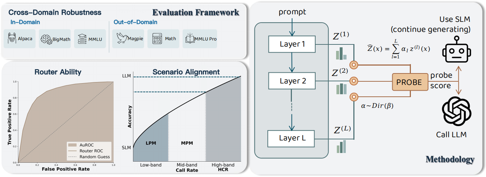

# CoBench：Towards Fair and Comprehensive Evaluation of Routers in Collaborative LLM Systems

<p>
  
  
  
  
</p>

CoBench is an **LLM routing / selective prediction** framework. Given a **weak model** (cheap) and a **strong model** (expensive), it trains/evaluates different **routers** (confidence/difficulty predictors) to decide when to escalate to the strong model, and reports metrics such as **recovery rate**, **call rate**, and **AUROC**.

The main entrypoint is `src/main.py` with three modes:

- `prepare`: generate artifacts per dataset (scores, logits/hidden states, query embeddings, ...)
- `train`: train routers (probe / embedding_mlp / trained_deberta / ...)
- `eval`: evaluate routers on datasets and write results to `src/metric_results/`

## 🗺️ Overview 


<p align="center">
  
</p>

The figure summarizes two things:

- **Methodology (right)**: a router predicts whether the **SLM/weak model** can answer correctly; if not, we **call the LLM/strong model**.
- **Evaluation framework (left)**: we evaluate **cross-domain robustness**, **router ability (AUROC)**, and **scenario alignment** under different call-rate regimes (**LPM / MPM / HCR**).

### Methodology: router families

All routers are implemented in `src/router.py` (and wired into the pipeline via `src/pipeline.py` / `src/main.py`).

CoBench provides four router families:

- **Verb-based** (`router_type=self_based`): routers that operate on model-generated text (verbalized signals), e.g. `semantic_entropy`, `self_questioning`.
- **Logits-based** (`router_type=logits_based_routers`): routers that operate on weak-model logits (and derived statistics), e.g. `max_logits`, `top10_variance`, `entropy`, `confidence_margin`, `logits_margin` (and `coe`).
- **Embedding-based** (`router_type=embedding_mlp`): route based on pre-computed query embeddings + an MLP head (`EmbeddingMLPRouter`).
- **Probe-based (ours)** (`router_type=probe`): route based on hidden states + a learned probe (`ProbeRouter`). In our setup we use `probe_type=mean` and `probe_type=dynamic_dirichlet`.

#### Probe-based (ours): Mean / DynamicDirichlet probes

CoBench supports two probe types used in our setup:

- `probe_type=mean`: uniform (deterministic) fusion, $\hat{z}(x)=\frac{1}{L}\sum_{l=1}^{L} z^{(l)}(x)$.
- `probe_type=dynamic_dirichlet`: **DynamicDirichlet** with a Dirichlet distribution over layer weights (below).

Given per-layer hidden states $z^{(1)}(x),\dots,z^{(L)}(x)$, we learn a distribution over layer-weights:

$$
\alpha(x) \sim \mathrm{Dir}(\beta(x)), \quad \hat{z}(x) = \sum_{l=1}^{L}\alpha_l(x)\, z^{(l)}(x)
$$

Then a probe head maps $\hat{z}(x)$ to a **probe score** (sigmoid) used for routing.

Notes (matching current CoBench code):

- **Training**: sample $\alpha$ from Dirichlet for regularization (stochastic fusion).
- **Inference**: use the Dirichlet **expected weights** (deterministic fusion). The concentration mass (e.g. $\beta_0=\sum_l \beta_l$) can serve as an uncertainty proxy (the default pipeline uses the sigmoid score for routing).

### Evaluation framework: what we measure

- **Cross-domain robustness**: evaluate in-domain and out-of-domain datasets (see [Datasets](#datasets)).
  - In-domain examples in our setting: Alpaca, BigMath, MMLU
  - Out-of-domain examples in our setting: Magpie, Math, MMLU-Pro
- **Router ability (AUROC)**: how well the router predicts whether the SLM answers correctly (binary label from correctness/LLM-judge).
- **Scenario alignment (call-rate regimes)**:
  - **LPM (Low-band Performance Mean)**: low call-rate band (strict budget)
  - **MPM (Mid-band Performance Mean)**: medium call-rate band
  - **HCR (High-band Call-Rate)**: high call-rate regime

These bands are controlled in config by `recovery_rate_band` and `lpm_call_rate_band` (see `config_B.yaml` and `src/config.py`).

## 🚀 Quickstart

### TL;DR: run CoBench end-to-end

At a high level you will:

- **(0) Configure** models + evaluation knobs in `config_B.yaml`
- **(1) Start services**: vLLM (weak/strong as needed) and xVerify (for math/mmlu/qa)
- **(2) Prepare** artifacts: `scores` / `logits` / `embeddings`
- **(3) Train** routers (probes / embedding_mlp / deberta)
- **(4) Eval** routers and write metrics

### Step 0: Configure

Default config is `config_B.yaml` (see `src/config.py:PipelineConfig.from_yaml`). You typically update:

- `inference.weak_model_path` / `inference.strong_model_path`
- `inference.base_port`, `inference.{weak,strong}_gpu_ids`, `inference.cuda_visible_devices`
- (if using GPT/Judge) set `OPENAI_API_KEY` / `OPENAI_API_BASE` env vars or fill them in YAML
- (for math/mmlu scoring) configure xVerify (`inference.xverify_model_url`, etc.)

### Step 1: Start services (vLLM + optional xVerify)

CoBench queries models via HTTP (`src/inference/vllm_client.py`).

- **When do I need vLLM?**
  - If your `prepare_steps` includes `scores` (default), you need inference access for **weak** and **strong**.
  - If your `eval` uses **self-based** routers (`semantic_entropy`, `self_questioning`), you need inference access for the **weak** model.
  - If `inference.strong_model_path=false` (use remote judge / API), you do not need a local strong-model vLLM.
- **When do I need xVerify?**
  - For `math / mmlu / qa` datasets, scoring uses xVerify to judge correctness (`src/loss_calculator.py`).

Example: start xVerify server (from `src/scripts/run.sh`):

```bash
CUDA_VISIBLE_DEVICES=3 \
vllm serve /volume/pt-train/users/wzhang/ghchen/zh/models/xVerify-9B-C \
  --host 0.0.0.0 \
  --port 8000 \
  --tensor-parallel-size 1 \
  --served-model-name xVerify \
  --trust-remote-code
```

Start server(s) first:

```bash
cd src/inference
python start.py --model_path "/path/to/your/model" --base_port 8001 --gpu_list "0,1"
```

### Step 2–4: Run the pipeline

Scripts are under `src/scripts/` (they `cd src` and temporarily patch config, restored on exit):

```bash
# prepare artifacts
bash src/scripts/prepare_all.sh

# train probes (datasets before -- ; probe types after --)
bash src/scripts/train_probes.sh alpaca_5k_train big_math_5k_train mmlu_train -- mean

# train DynamicDirichlet probe
bash src/scripts/train_probes.sh alpaca_5k_train big_math_5k_train mmlu_train -- dynamic_dirichlet

# evaluate routers
bash src/scripts/eval.sh
```

### What does `prepare` produce? (artifacts & outputs)

`prepare` can run three steps (controlled by `prepare_steps` in config / `src/scripts/prepare_all.sh`):

- **scores**: runs weak/strong inference and writes per-sample correctness labels under `results/`.
  - For `general` datasets, scoring uses LLM-as-a-judge (`llm_judge_general` in `src/data.py`).
  - For `math / mmlu / qa` datasets, scoring uses xVerify (`src/loss_calculator.py`).
- **logits**: generates weak-model logits + hidden states (used by logits-based routers and probes), written under `logits_output/` and `hs/`.
- **embeddings**: generates query embeddings (used by `embedding_mlp`), written under `query_embeddings_output/`.

## 🔀 Routers

Select the router via `router.router_type` in `config_B.yaml`:

- **Probe family**: `probe` + `probe_type` (e.g. `mean/max/hs_last_mlp/coe_dual_mlp/dynamic_dirichlet/...`; see `src/router.py:get_available_probe_types`)
- **Embedding MLP**: `embedding_mlp` (needs `query_embeddings_output` and `router.checkpoint_path`)
- **Self-based**: `semantic_entropy` / `self_questioning`
- **Logits-based**: `max_logits/top10_variance/entropy/confidence_margin/coe`
- **(Trained) DeBERTa**: `trained_deberta`

Batch modes (convenience):

- `router_type=self_based` will evaluate `semantic_entropy` and `self_questioning`.
- `router_type=logits_based_routers` will evaluate `max_logits`, `top10_variance`, `coe`, `entropy`, and `confidence_margin`.

### Enable DynamicDirichlet router (minimal YAML)

```yaml
router:
  router_type: "probe"
  probe_type: "dynamic_dirichlet"
  checkpoint_path: "probe_save/your_checkpoint.pt"
```

Then:

```bash
cd src
python main.py --mode eval --datasets math mmlu_test alpaca_5k_test
```

> Note: `dynamic_dirichlet` requires hidden states for the dataset (by default under repo-root `hs/`, named like `<weak_model_name>_<dataset>.pt`; MMLU-Pro uses `hs/mmlu_pro/`).

## 📚 Datasets

Built-in dataset names are defined in `src/data.py:DatasetRegistry`. Commonly used ones:

- In-domain: `alpaca_5k_{train,test}`, `big_math_5k_{train,test}`, `mmlu_{train,test}`
- Out-of-domain: `magpie_5k_{train,test}`, `math`, `mmlu_pro_*`
- QA: `hotpotqa_500`, `hotpotqa_4k`, `med_qa_1k`

If you need to generate some JSONL under `src/data/`, helper scripts exist:

```bash
python src/utils/download_alpaca_data.py 10
python src/utils/download_hotpotqa.py -n 500
python src/utils/download_med_qa.py -n 1000
```

## Notes

- This repo may reference `external/xverify` for certain correctness evaluation workflows.
- Logs are written under `src/logs/`.

